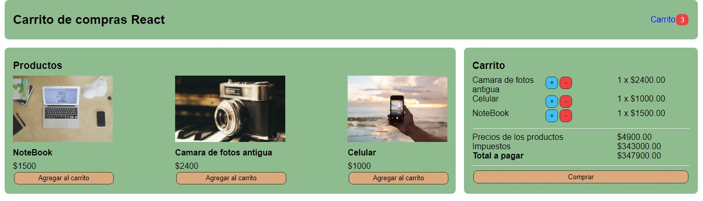

Carrito de compras hecho con React Js

<h2>Tres componentes iniciales.</h2>
<ul>
  <li>Header</li>
  <li>Main</li>
  <li>Basket</li>
</ul>
<h3>y dos sub-componentes </h3>
<ul>
  <li>Products</li>
  <li>data</li>
</ul>

Utilize el hook useState para cambiar el estado de los items del carrito.El metodo lenght con condicional para saber si el carrito estaba vacio.
  El metodo find para encontrar el id del producto que quiero agregar y luego compararlo con el producto ya existente.El evento onClick para los botones y asi
  agregar al  carrito los productos. El metodo map para que en el arreglo de los productos con su key y id  no se repitan los productos seleccionados que se muestran en el carrito.Ademas el metodo toFixed para indicar la cantidad de numeros decimales a tener en cuenta y el metodo filter para eliminar los productos no deseados del carrito.Por ultimo,el metodo reduce para acumular el valor de los productos que se muestren en el carrito

  

